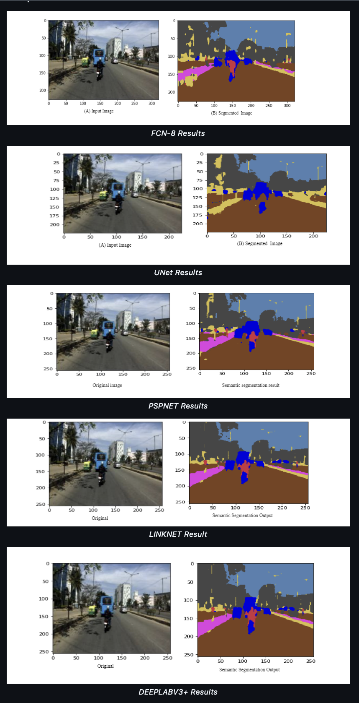

# Road Scene Semantic Segmentation

A PyTorch-based implementation of various deep learning architectures for semantic segmentation of unstructured road scenes using the Indian Driving Dataset (IDD).



## Project Overview

This project implements and compares five popular deep learning architectures for semantic segmentation:
- FCN (Fully Convolutional Network)
- U-Net
- PSPNet
- LinkNet
- DeepLabV3+

The models are trained on the IDD-Lite dataset, which contains road scene images from Indian cities, annotated with 8 classes:
- Drivable area
- Non-drivable area
- Living things
- Vehicles
- Roadside objects
- Far objects
- Sky
- Miscellaneous

## Results

Model performance comparison on IDD-Lite dataset:

| Architecture | Training Set | Testing Set | Mean F1 Score |
|--------------|-------------|-------------|---------------|
| FCN          | 0.9032      | 0.9034      | 0.687        |
| UNET         | 0.8784      | 0.7406      | 0.586        |
| PSPNET       | 0.9172      | 0.7385      | 0.733        |
| LINKNET      | 0.9231      | 0.7579      | 0.750        |
| DEEPLABV3+   | 0.8040      | 0.7712      | 0.787        |

## Installation

```bash
# Clone the repository
git clone https://github.com/your-username/road-scene-segmentation.git
cd road-scene-segmentation

# Install dependencies
pip install -e .
```

### Requirements
- Python 3.7+
- PyTorch >= 1.9.0
- torchvision >= 0.10.0
- albumentations >= 1.0.3
- OpenCV
- NumPy
- Matplotlib
- tqdm

## Dataset Setup

The project uses IDD-Lite dataset (~50MB). To set up the dataset:

```bash
python setup_data.py
```

This will download and organize the IDD-Lite dataset in the correct directory structure.

## Usage

### Training

To train a model:

```bash
python train.py --config config.yaml
```

Configure training parameters in `config.yaml`:
```yaml
MODEL_TYPE: 'unet'  # Options: 'fcn', 'unet', 'pspnet', 'linknet', 'deeplabv3'
BACKBONE: 'resnet34'
NUM_CLASSES: 8
BATCH_SIZE: 16
EPOCHS: 100
LEARNING_RATE: 0.001
```

### Evaluation

To evaluate a trained model:

```bash
python evaluate.py --config config.yaml --model-path checkpoints/final_model.pth
```

### Inference

For inference on a single image:

```python
from segmentation import SegmentationConfig, UNet, Visualizer
import cv2

# Initialize model and load weights
config = SegmentationConfig(MODEL_TYPE='unet')
model = UNet(config)
model.load_checkpoint('checkpoints/final_model.pth')

# Run inference
image = cv2.imread('path/to/image.jpg')
prediction = model.predict(image)
```

## Project Structure

```
├── segmentation/
│   ├── models/
│   │   ├── fcn.py
│   │   ├── unet.py
│   │   ├── pspnet.py
│   │   ├── linknet.py
│   │   └── deeplabv3.py
│   ├── config.py
│   ├── dataset.py
│   └── utils/
├── train.py
├── evaluate.py
├── setup_data.py
└── config.yaml
```

## Model Architectures

The project implements five different architectures for comparison:

1. **FCN**: Fully Convolutional Network with VGG16 backbone
2. **U-Net**: Classic encoder-decoder architecture with skip connections
3. **PSPNet**: Pyramid Scene Parsing Network
4. **LinkNet**: Efficient encoder-decoder with residual connections
5. **DeepLabV3+**: State-of-the-art architecture with ASPP module

